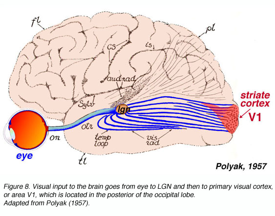

## Introduction to fMRI


This case study examines data collected from a functional Magnetic Resonance Imaging (fMRI) experiment  performed on a single individual by the Gallant neuroscience lab at UC Berkeley (see relevant papers by the Gallant lab [here](http://machinelearning.wustl.edu/mlpapers/paper_files/NIPS2008_0963.pdf) and [here](https://projecteuclid.org/download/pdfview_1/euclid.aoas/1310562717)). 

fMRI measures oxygenated blood-flow in the brain which can be considered as an indirect measure of neural activity (the two processes are highly correlated). The measurements obtained from an fMRI experiment correspond to the aggregated response of hundreds of thousands of neurons within cube-like voxels of the brain. The segmentation of the brain into 3D voxels is analogous to the segmentation of an image into 2D pixels.


This case study will use superheatmaps to explore the relationship between the image stimuli and the predicted voxel responses to these images.

## The data {#data}


The data contains the fMRI measurements (averaged over 10 runs of the experiment) for each of approximately 1,300 voxels located in the visual cortex of a single individual in response to viewings of 1,750 different images (such as a picture of a baby, a house or a horse). 

To help visualize what's going on, the figure below shows an individual viewing images while in an fMRI machine.


```{r fmriexperiment, echo = FALSE, fig.align = "center", fig.cap="An individual viewing an image while in an fMRI machine"}
knitr::include_graphics("images/fmri.png")
```


Each image is a $128 \times 128$ pixel gray-scale image which can be represented by a vector of length $128^2 = 16,384$ but can be reduced to length $10,921$ through a [Gabor wavelet transformation](https://en.wikipedia.org/wiki/Gabor_wavelet). 


The raw data is stored on the Collaborative Research in Computational Neuroscience (CRCNS) Data Sharing repository, and can be found [here](https://crcns.org/data-sets/vc/vim-1). Note that in order to access the data, you will need to request a CRCNS account in which you describe what you're planning to do with the data, but this is fairly straightforward.


## Loading Superheat

Installing the superheat package from github is easy, assuming you have the `devtools` package installed in R. Simply type the following command:

```{r install-superheat, eval = FALSE}
# install devtools if you don't have it already
install.packages("devtools")
# install the development version of superheat
devtools::install_github("rlbarter/superheat")
```


Assuming that you didn't run into any unfortunate errors when installing the package, you can load the package into R in the normal way.

```{r load_superheat, message=FALSE, warning=FALSE}
library(superheat)
```


## Viewing the raw images

```{r, warning=FALSE, message=FALSE}
# some useful libraries
library(ggplot2)
library(dplyr)
library(gridExtra)
library(knitr)
library(RColorBrewer)
```


It is helpful to have an idea of what kind of images the subject was viewing. The raw images are contained in the `Stimuli.mat` file, and is separated into a set of 1,750 training images (used to train our models) and 120 validation images (used to evaluate model performance).

The code below loads in the data and extracts the training and validation images


```{r, cache = TRUE, warning=FALSE, message=FALSE}
# a library for loading matlab files
library(R.matlab)
# load in the stimuli images
stimuli <- readMat("raw_data/Stimuli.mat")
# extract training stimuli array
train.stimuli <- stimuli[[1]]
# extract validation stimuli array
val.stimuli <- stimuli[[2]]
# remove the original stimuli object
rm(stimuli)
```

We display four of the training images below using our superheat package.

```{r, fig.show='hold', fig.width=6, fig.height = 6, fig.align='center'}
# view some of the images
im1 <- superheat(train.stimuli[1, 128:1, ], 
          heat.pal = c("black", "white"),
          legend = FALSE,
          print.plot = F)
im2 <- superheat(train.stimuli[3, 128:1, ], 
          heat.pal = c("black", "white"),
          legend = FALSE,
          print.plot = F)
im3 <- superheat(train.stimuli[10, 128:1, ], 
          heat.pal = c("black", "white"),
          legend = FALSE,
          print.plot = F)
im4 <- superheat(train.stimuli[15, 128:1, ], 
          heat.pal = c("black", "white"),
          legend = FALSE,
          print.plot = F)
# place the images in a 2x2 grid
grid.arrange(im1$plot, im2$plot, im3$plot, im4$plot, ncol = 2)
```


## Preparing the data for analysis

Despite best efforts, sadly not all of the data is publicly available. The Gabor wavelet filters, for example, are not available on the CRCNS website (see above), but the dedicated reader can try to generate their own Gabor wavelets using the raw images contained in Stimuli.mat (see [above](#data)).

### Gabor wavelet features

I, however, have access to a file, `fMRIdata.RData` which contains the Gabor wavelet features for the training and validation set images. These Gabor feature matrices are contained in the `fit_feat` and `val_feat` objects from the fMRIdata.Rdata file (again, this is unfortunately not publicly available).

```{r, cache = TRUE}
# load in the gabor wavelet filters
load("processed_data/fMRIdata.RData") # not available in github
# fit_feat contains the gabor wavelet features for the 1750 training images
train.feat <- fit_feat
dim(train.feat)
# val_feat contains the gabor wavelet features for the 120 validation images
val.feat <- val_feat
dim(val.feat)
# Remove the other objects that correspond to the responses of a subset of the voxels
rm(fit_feat)
rm(val_feat)
rm(resp_dat)
rm(loc_dat)
```


### The voxel responses

The voxel responses to each image was collected for two subjects, "S1" and "S2". We will restrict our analysis to predicting the voxel response in the V1 region for Subject 1 only (see the image below taken from Matthew Schmolesky's [Webvision](http://webvision.med.utah.edu/book/part-ix-psychophysics-of-vision/the-primary-visual-cortex/)).

```{r, echo = FALSE, fig.align = "center"}

```

Loading in the voxel responses (from the `EstimatedResponses.mat` file) involves first converting the .mat file to a format readable by R. Specifically I had to convert the data to version 6 MATLAB file in Octave:

```{r, eval = FALSE}
# In Octave, run:
>> dat = load("EstimatedResponses.mat")
>> save("-V6", "EstimatedResponsesV6.mat", "dat")
```

Having converted the original MATLAB file to version 6 MATLAB file, we can load it into R using the `R.matlab` package.

```{r read-matlab-file, cache = TRUE}
# load in the Version 6 matlab file
voxel.response <- readMat("processed_data/EstimatedResponsesV6.mat")$dat
dimnames(voxel.response)[[1]]
```

We can then filter through the objects contained in this file to extract only the responses for the 1331 V1 voxels to the training and validation images.


```{r, cache = TRUE}
# extract useful objects
# the columns of train.resp are the 1,750 training images
# the rows are the 25,915 voxels
train.resp <- voxel.response[[1]]
# the columns of val.resp are the 120 training images
# the rows are the 25,915 voxels
val.resp <- voxel.response[[3]]
# extract the V1 voxels
V1.vox.index <- which(voxel.response[[5]][, 1] == 1)
# there are 1331 V1 voxels
length(V1.vox.index)
# filter train.resp and val.resp to the V1 voxels only
train.resp <- train.resp[V1.vox.index, ]
val.resp <- val.resp[V1.vox.index, ]
# remove the remaining data
rm(voxel.response)
```


## Cleaning the data

The final data objects in our workspace are

```{r, collapse = TRUE}
ls()
```

where

* `train.stimuli`: a $1750 \times 128 \times 128$ array corresponding to the 1,750 raw training images each of dimension $128 \times 128$.

* `val.stimuli`: a $120 \times 128 \times 128$ array corresponding to the 120 raw validation images each of dimension $128 \times 128$.

* `train.feat`: a $1750 \times 10921$ matrix corresponding to the 10,921 Gabor wavelet features for each of the 1,750 training images.

* `val.feat`: a $120 \times 10921$ matrix corresponding to the 10,921 Gabor wavelet features for each of the 120 validation images.

* `train.resp`: a $1331 \times 1750$ matrix containing the responses of the 1,331 voxels in the V1 region to each of the 1,750 training images.

* `val.resp`: a $1331 \times 120$ matrix containing the responses of the 1,331 voxels in the V1 region to each of the 120 validation images.


### Missing values

Note that of the 1,331 voxels in the V1 region, 37 of them have at least 40% missing responses. So we will remove these voxels.

```{r, cache = TRUE, collapse = T}
# identify the proportion of missing values for each voxel
missing.variables <- apply(train.resp, 1, function(x) sum(is.na(x)) / length(x))
# print the proportion of missingness for the voxels with at 
# least some missingness.
length(missing.variables[missing.variables > 0])
```

```{r, cache = TRUE}
# remove these voxels from the training and validation sets
train.resp <- t(train.resp[which(missing.variables == 0), ])
val.resp <- t(val.resp[which(missing.variables == 0), ])
```


```{r, cache = TRUE, eval = FALSE}
save(train.feat, train.resp, file = "processed_data/fmri_training_data.RData")
save(val.feat, val.resp, file = "processed_data/fmri_validation_data.RData")
```


```{r, cache = TRUE, collapse = TRUE}
# number of voxels remaining after removing missing values
ncol(train.resp)
```

We now thus have 1,294 voxels in the V1 region.

## Modeling

For each of our models, our goal is to predict the response to the viewing of an image for each of the 1,294 voxels (cubic region in the brain). 

That is, we have 1,294 separate models (one for each voxel), where the predictors/variables correspond to the 10,921 Gabor features from the training images.

### Feature selection

To speed up our rough analysis, we decided to filter the 10,921 Gabor features to the 500 that were most correlated with each voxel.

To identify the correlation of each Gabor feature with each voxel response, we ran the following code (also contained in the `code/voxel_cor.R` file [that can be found here](https://github.com/rlbarter/superheat-examples/tree/master/fMRI/code)) on the statistics department computer cluster at UC Berkeley. You could probably run it on your laptop, but I would advise against it unless you are incredibly patient.

```{r, eval = FALSE}
library(parallel)

nCores <- 24  # to set manually 
cl <- makeCluster(nCores) 

# export the necessary variables
clusterExport(cl, c("train.feat", "train.resp", "glmnet"), 
              envir=environment()) 
# calcualte the correlation of each variable with each voxel
cor.vox <- parLapply(cl, data.frame(train.resp), function(voxel) {
  apply(train.feat, 2, function(feature) cor(voxel, feature))
})
# save the results
save(cor.vox, file = "results/voxel_cor.RData")
```


Next, to identify the 500 Gabor features that are most correlated with each voxel, we can simply load the correlation data saved above and run the following code.

```{r}
load("results/voxel_cor.RData")
# identify the 500 most correlated features for each variable
top.features <- lapply(cor.vox, function(cor) {
  order(cor, decreasing = TRUE)[1:500]
})
```


## Lasso + OLS model 

We now fit a [lasso linear model](https://en.wikipedia.org/wiki/Lasso_(statistics)) to predict the voxel responses to the image stimuli. 

The $1750 \times 500$ design matrix (feature matrix) can be represented as follows:

$$ X = \left[ \begin{array}{cccc} x_{1, 1} & x_{1, 2} & ... & x_{1, 500} \\
x_{2, 1} & x_{2, 2} & ... & x_{2, 500} \\
\vdots & \vdots & ... & \vdots \\
x_{1750, 1} & x_{1750, 2} & ... & x_{1750, 500} \end{array} \right]$$

where $x_{i, j}$ is the **$j$th Gabor wavelet feature value for the $i$th image**.

We have 1,294 response vectors (as we fit 1,294 separate models) each of which contains the response for an individual voxel to the $1750$ training images. The response vector for voxel $v \in \{1, ..., 1294\}$ can be written as:

$$\textbf{y}_v = \left[\begin{array}{c} y_{1}^v \\ y_{2}^v \\ \vdots \\ y_{1750}^v \end{array} \right]$$


To fit these 1,294 models, the following code was run using the Statistics Department cluster at UC Berkeley. You will not be able to run this code on your laptop.

```{r, eval = FALSE}
library(glmnet)
library(parallel)
# set up the cluster for parallelization
nCores <- 24  # to set manually 
cl <- makeCluster(nCores) 

# load the CV parameter selection function
source("code/select_lambda.R")

# fit the lasso model to each voxel using the 1000 most correlated features
# for the voxel.
clusterExport(cl, c("train.feat", "train.resp", "glmnet", "top.features"), 
              envir=environment()) 
lasso.list <- parLapply(cl, 1:ncol(train.resp), function(voxel) {
  glmnet(x = train.feat[, top.features[[voxel]]], 
         y = as.vector(train.resp[ , voxel])) 
})
# extract the lambda sequence from each voxel
# we want to avoid the ends of the sequence
# note that some sequences terminate early so providing a 
# universal endpoint for the vector sometimes produces an error
lambda.seq <- lapply(lasso.list, function(model) {
  model$lambda[5:length(model$lambda)]
  })

# use CV to select the best lambda for each voxel-model
# export the necessary variables
clusterExport(cl, c("train.feat", 
                    "train.resp", "top.features", 
                    "cv.glmnet", "lambda.seq"), 
              envir=environment()) 
# the ith entry of selected.lambda corresponds to the 
# best lambda value for voxel i
selected.lambda <- selectLambda(cl = cl, x.mat = train.feat, 
                       y.mat = train.resp, features = top.features, 
                       lambda.seq = lambda.seq)
# save the results
save(lasso.list, selected.lambda, top.features, 
     file = "results/lasso_results_top500.RData")
# stop the cluster
stopCluster(cl)
```


Having run the above code on the cluster and saved the results in the file `lasso_results_top500.RData`, we can load the results into the current R session and calculate the corresponding voxel response predictions.

First, we can extract the model coefficients for each model (since we saved the results for each possible lambda, we need to filter to the model with the "best" lambda).

```{r, cache = TRUE, message=FALSE}
load("results/lasso_results_top500.RData")
# extract the best model from lasso.list (above) corresponding to the best lambda
beta <- lapply(1:length(lasso.list), function(voxel) {
  model.index <- which(lasso.list[[voxel]]$lambda == selected.lambda[voxel])
  as.matrix(lasso.list[[voxel]]$beta)[, model.index]
})
```


We can also identify which feature was selected (had a non-zero lasso coefficient) by each voxel.

```{r}
# identify the selected features for each voxel
selected.features.list <- lapply(1:length(top.features), function(voxel) {
  # idenitfy which features were selected for the voxel
  # start with the features used to train the lasso model
  voxel.features <- top.features[[voxel]]
  # obtain the coefficients for these feautures
  voxel.features.selected <- beta[[voxel]] != 0
  # filter the features index and beta vector to the non-zero coefficients
  voxel.features <- voxel.features[voxel.features.selected]
})
```


Next, for each voxel we re-fit a classical un-regularized OLS model for each voxel based on the selected (non-zero) coefficients from the corresponding lasso model.

```{r, cache = TRUE}

# fit an OLS model for each voxel based on the selected features
ols.list <- lapply(1:ncol(train.resp), function(voxel) {
  voxel.features <- selected.features.list[[voxel]]
  # filter the feature matrix to these selected features
  voxel.train <- as.data.frame(train.feat[, voxel.features])
  colnames(voxel.train) <- paste0("X", 1:ncol(voxel.train))
  voxel.train$y <- train.resp[, voxel]
  # fit an OLS model
  lm(y ~ ., data = voxel.train)
})

```

### Evaluating the model on the validation set


The code below extracts the predicted voxel response for the validation set.

```{r, cache = TRUE}
# calculate the predicted voxel responses for each image in the TRAINING set
predictions <- lapply(1:ncol(val.resp), function(voxel) { 
  # extract the selected Gabor features for the current voxel
  voxel.val <- as.data.frame(val.feat[, selected.features.list[[voxel]]])
  colnames(voxel.val) <- paste0("X", 1:ncol(voxel.val))
  # predict the voxel response for the validation images 
  predict.lm(ols.list[[voxel]], voxel.val)
})
```


Below we calculate and plot the correlation of the true voxel responses with the predicted voxel responses for each of the 1,294 voxels.

```{r, cache = TRUE}
# calculate the correlation between the predictions and the true responses for each voxel
prediction.cor <- sapply(1:ncol(val.resp), function(voxel) {
  cor(predictions[[voxel]], val.resp[ ,voxel])
})
# convert to data frame
prediction.cor <- data.frame(voxel = 1:length(prediction.cor), cor = prediction.cor)
```

```{r histogram, fig.align='center', fig.cap = "A histogram of the correlation of the true voxel response on the validation images and the predicted voxel response on the validation images for each of the 1294 voxels."}
# plot a histogram of the correlations between the true and predicted voxel responses
ggplot(prediction.cor) + 
  geom_histogram(aes(x = cor), col = "white", binwidth = 0.02) +
  scale_y_continuous(name = "Number of voxels") +
  scale_x_continuous(name = "Correlation of predicted and true voxel response") 
```

We see that there appear to be two groups of voxels: those whose whose true and predicted correlations are quite low (around 0.2), and another group whose correlations are around 0.6.

### Visualizing voxel performance accross all voxels

We will now use superheat to simultaneously evaluate the performance of the lasso models for predicting the responses to the validation images of each of the 1294 voxels.

First we will cluster the images and voxels into two groups for visualization purposes.

```{r, cache = TRUE}
set.seed(384653)
# calculate row clusters
image.clusters <- kmeans(val.resp, centers = 2)$cluster
# calcualte column clusters
voxel.clusters <- kmeans(t(val.resp), centers = 2)$cluster
save(voxel.clusters, file = "results/voxel_clusters.RData")
```


Below we plot some examples of images from each cluster clusters. The following presents four images from the first cluster

```{r, fig.align = "center"}
set.seed(23847)
four.images.cl1 <- sample(which(image.clusters == 1), 4)
cl1.im1 <- superheat(val.stimuli[four.images.cl1[1], 128:1, ], 
          heat.pal = c("black", "white"),
          legend = FALSE,
          print.plot = FALSE)
cl1.im2 <- superheat(val.stimuli[four.images.cl1[2], 128:1, ], 
          heat.pal = c("black", "white"),
          legend = FALSE,
          print.plot = FALSE)
cl1.im3 <- superheat(val.stimuli[four.images.cl1[3], 128:1, ], 
          heat.pal = c("black", "white"),
          legend = FALSE,
          print.plot = FALSE)
cl1.im4 <- superheat(val.stimuli[four.images.cl1[4], 128:1, ], 
          heat.pal = c("black", "white"),
          legend = FALSE,
          print.plot = FALSE)
grid.arrange(cl1.im1$plot, cl1.im2$plot, cl1.im3$plot, cl1.im4$plot, ncol = 2)

```

```{r, echo = FALSE, eval = FALSE}
# png("../../Figures/Images/cl1.png")
grid.arrange(cl1.im1$plot, cl1.im2$plot, cl1.im3$plot, cl1.im4$plot, ncol = 2)
# dev.off()
```

While the next four images are from the second cluster.

```{r fig.align="center"}
set.seed(23847)
four.images.cl2 <- sample(which(image.clusters == 2), 4)
cl2.im1 <- superheat(val.stimuli[four.images.cl2[1], 128:1, ], 
          heat.pal = c("black", "white"),
          legend = FALSE,
          print.plot = FALSE)
cl2.im2 <- superheat(val.stimuli[four.images.cl2[2], 128:1, ], 
          heat.pal = c("black", "white"),
          legend = FALSE,
          print.plot = FALSE)
cl2.im3 <- superheat(val.stimuli[four.images.cl2[3], 128:1, ], 
          heat.pal = c("black", "white"),
          legend = FALSE,
          print.plot = FALSE)
cl2.im4 <- superheat(val.stimuli[four.images.cl2[4], 128:1, ], 
          heat.pal = c("black", "white"),
          legend = FALSE,
          print.plot = FALSE)
grid.arrange(cl2.im1$plot, cl2.im2$plot, cl2.im3$plot, cl2.im4$plot, ncol = 2)
```

```{r, echo = FALSE, eval = FALSE}
# png("../../Figures/Images/cl2.png")
grid.arrange(cl2.im1$plot, cl2.im2$plot, cl2.im3$plot, cl2.im4$plot, ncol = 2)
# dev.off()
```


Next, we plot a heatmap of the *validation response* matrix, that is, the response of each voxel to each validation image. Above each column in the heatmap (each column corresponds to a voxel), we plot the correlation of the observed voxel response with the predicted voxel response.

```{r, echo= FALSE, cache = TRUE, fig.align="center", fig.height = 7, fig.width = 6, results="hide", eval = FALSE}
# png(file = "../../Figures/lasso-validation-all.png", 
#     height = 800, width = 1100)
superheat(val.resp, 
          
          heat.pal = brewer.pal(5, "RdBu"),
          yt = prediction.cor$cor,
          yt.axis.name = "Correlation between\npredicted and true\nvoxel responses",
          yt.obs.col = rep("slategray4", ncol(val.resp)),
          yt.point.alpha = 0.6,
          yt.plot.size = 0.7,
          yt.point.size = 4,
          yt.axis.size = 24,
          yt.axis.name.size = 24,
          
          membership.rows = image.clusters,
          membership.cols = voxel.clusters,
          
          left.label = "none",
          bottom.label = "none",
          grid.hline.col = "white",
          grid.vline.col = "white",
          grid.hline.size = 4,
          grid.vline.size = 4,
          
          row.title = "Validation images (120)",
          row.title.size = 10,
          column.title = "Voxels (1,294)",
          column.title.size = 10,
          title = "(a)",
          title.size = 12,
          
          legend.width = 3,
          legend.height = 0.3,
          legend.text.size = 18)
# dev.off()
```


```{r, cache = TRUE, fig.align="center", fig.height = 7, fig.width = 6}
superheat(val.resp, 
          yt = prediction.cor$cor,
          yt.axis.name = "Correlation between\npredicted and true\nvoxel responses",
          
          heat.pal = brewer.pal(5, "RdBu"),
          
          yt.obs.col = rep("slategray4", ncol(val.resp)),
          yt.point.alpha = 0.6,
          yt.axis.name.size = 12,
          yt.plot.size = 0.7,
          yt.point.size = 2,
          
          membership.rows = image.clusters,
          membership.cols = voxel.clusters,
          
          left.label = "none",
          bottom.label = "none",
          grid.hline.col = "white",
          grid.vline.col = "white",
          grid.hline.size = 2,
          grid.vline.size = 2,
          
          row.title = "Validation images (120)",
          column.title = "Voxels (1,294)",
          title = "(a)")
```

The heatmap above is very busy as a lot of information is being crammed into a small number of pixels. It is thus often much easier to "smooth" the heatmap within its clusters to highlight the "big picture". 

```{r, echo = FALSE, fig.align="center", fig.height = 7, fig.width = 6, results = "hide", eval = FALSE}
# png(file = "../../Figures/lasso-validation-all-smooth.png", 
#     height = 800, width = 1100)
superheat(val.resp, 
          X.text = matrix(c("lower\nvoxel\nresponse",
                            "higher\nvoxel\nresponse",
                            "neutral\nvoxel\nresponse", 
                            "neutral\nvoxel\nresponse"), ncol = 2),
          X.text.col = matrix(c("white", "white", "black", "black"), ncol = 2),
          X.text.size = 8,
          
          heat.pal = brewer.pal(5, "RdBu"),
          
          yt = prediction.cor$cor,
          yt.axis.name = "Correlation between\npredicted and true\nvoxel responses",
          yt.plot.type = "boxplot",
          yt.cluster.col = "slategray4",
          yt.plot.size = 0.7,
          yt.axis.size = 24,
          yt.axis.name.size = 24,
          
          membership.rows = image.clusters,
          membership.cols = voxel.clusters,
          
          left.label = "none",
          bottom.label = "none",
          grid.hline.col = "white",
          grid.vline.col = "white",
          grid.hline.size = 4,
          grid.vline.size = 4,
          
          smooth.heat = T,
          row.title = "Validation images (120)",
          row.title.size = 10,
          column.title = "Voxels (1,294)",
          column.title.size = 10,
          title = "(b)",
          title.size = 12,
          
          legend.width = 3,
          legend.height = 0.3,
          legend.text.size = 18)
# dev.off()
```

```{r, fig.align="center", fig.height = 7, fig.width = 6}
superheat(val.resp, 
          
           X.text = matrix(c("lower\nvoxel\nresponse",
                            "higher\nvoxel\nresponse",
                            "neutral\nvoxel\nresponse", 
                            "neutral\nvoxel\nresponse"), ncol = 2),
          X.text.col = matrix(c("white", "white", "black", "black"), ncol = 2),
          
          smooth.heat = T,
          
          heat.pal = brewer.pal(5, "RdBu"),
          
          yt = prediction.cor$cor,
          yt.axis.name = "Correlation between\npredicted and true\nvoxel responses",
          yt.plot.type = "boxplot",
          yt.cluster.col = "slategray4",
          yt.axis.name.size = 12,
          yt.plot.size = 0.7,
          
          membership.rows = image.clusters,
          membership.cols = voxel.clusters,
          
          left.label = "none",
          bottom.label = "none",
          grid.hline.col = "white",
          grid.vline.col = "white",
          grid.hline.size = 2,
          grid.vline.size = 2,
          
          row.title = "Validation images (120)",
          column.title = "Voxels (1,294)",
          title = "(b)")
```


What we can see is that the two clusters of voxels behave very differently: 

* the first cluster of voxels is much more active in response to viewings of images from the second cluster of images than to images from the first cluster.

* the second cluster of voxels does not appear to exhibit a strong difference in response to the two clusters of images.

Furthermore, the predicted responses for the first cluster of voxels are much more correlated with the true responses for these voxels, with an average correlation of around 0.5. The predicted responses to the second cluster of voxels, on the other hand, have approximately zero correlation with the true responses exhibited by these voxels.


## Exploring the voxel clusters

Notice that we found two clusters of voxels that respond to the visual stimuli differently: the first cluster of voxels is highly sensitive to visual stimuli, whereas the second cluster is not.

Our goal is to explore the physical locations of the voxels. We can load in the locations data that can be found on Yuval Benjamini's [website](http://statweb.stanford.edu/~yuvalben/stat312/dataset_1/v1_locations.RData).

```{r, collapse = TRUE}
load("raw_data/v1_locations.RData")
# v1 locations
dim(v1_locations)
head(v1_locations)
```

Note that `v1_locations` appears to hold the (x, y, z)-locations of each V1 voxel. However, recall that we had a number of voxels with mostly missing values. We remove these from our location data frame below.

```{r}
v1.locations <- as.data.frame(v1_locations[which(missing.variables == 0), ])
colnames(v1.locations) <- c("x", "y", "z")
v1.locations$cluster <- factor(voxel.clusters)
rm(v1_locations)
```

Next, we can plot the voxels in space.


```{r, message=FALSE, warning=FALSE, eval = FALSE}
library(plotly)
voxel.clusters <- factor(paste("cluster", voxel.clusters))
plot_ly(v1.locations, x = ~x, y = ~y, z = ~z, 
        color = ~cluster, 
        type = "scatter3d",
        mode = "markers",
        colors = c('#e41a1c', '#377eb8'),
        marker = list(line = list(color = 'black', width = 1.5))) %>%
  layout(scene = list(xaxis = list(title = 'x'),
                   yaxis = list(title = 'y'),
                   zaxis = list(title = 'z')))
```


<center>
```{r, message=FALSE, warning=FALSE, out.height=800, out.width=800}
library(plotly)
voxel.clusters <- factor(paste("cluster", voxel.clusters))
plot_ly(v1.locations, x = ~x, y = ~y, z = ~z, 
        color = ~cluster, 
        type = "scatter3d",
        mode = "markers",
        colors = c('#e41a1c', '#377eb8'),
        marker = list(line = list(color = 'black', width = 1.5))) %>%
  layout(scene = list(xaxis = list(title = 'x'),
                   yaxis = list(title = 'y'),
                   zaxis = list(title = 'z')))
```

</center>